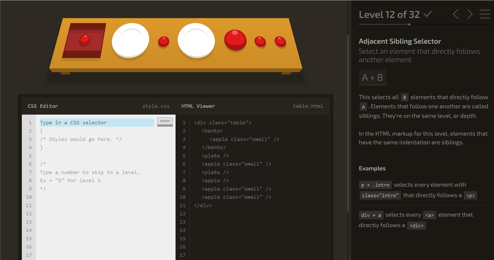

# Week 6 - [Advanced CSS]

<h4 class="date"><em>Date: Feb 24th, 2026 & Feb 26th, 2026 </em></h4>

## Class notes 
- what we have learned so far:
    - how web works: DNS, HTTP, and client-server model
    - HTML: document structure, common tags, attributes; semantic HTML, accessibility
    - CSS: adding CSS, cascading + specificity, selectors (elements, class, ID, combining), typography, goggle fonts, colors and box models 
    - remember that EVERY element has a box model!
- the way to figure out what fonts and colors a website is using is --> right click, inspect, and hover over the part you want to know more about (it will show all the CSS assigned to that specific section of the page)
- when your external CSS says that your h1 is supposed to be blue and it appears red, the issue could be:
    - it could be saying the header is red in the internal CSS code (inline will always have the highest priority)
    - you could be referencing incorrectly 
    - higher specificity wins
    - maybe the wrong file is linked so your stylesheet is not truly applied 
    - the element is not really an h1 (or a parent style + inheritence/custom property setup changes computed color)
- why is it recommended for external CSS files over inline styles?
    - easier to apply to multiple pages instead of just one specific page
    - if we have a website with many html files, it is easier to style them with an external css style page 
- selectors we have already seen:
    - element p{}
    - class .intro{}
    - ID #header{}
    - descendent nav a{}
    - grouping h1, h2{}
        - prefer classes for styling, use IDs for unique JS/anchor references
 - < div > & < span >
 they are 2 generic containers for grouping and styling. no semantic meaning:
    - < div > =  block container (sections, cards, wrappers)
    - < span > = inline container (highlight a word, style part of text)
- block elements stack vertically, take full width:
    -  <> (everything goes within those tags): p, h1, ul, li, section
- inline elements flow side by side, like words in a sentence:
    - <> (everything goes within those tags): span, a, strong, img
that is why 2 < img > tags sit next to each other, not stacked and why < li > items each get their own line
- Pseudo-classes & transitions:
    - *when a mouse hovers over a link*
a:hover {
    color: red;
    text-decoration: underline;
}

    - *first and last child elements*
li:first-child {font-weight: bold; }
li:last-child {color: gray; } 

    - *every other row (useful for tables/lists)*
tr:nth-child(even) {
    background-color: #f2f2f2;
}  

    - *links that have been visited:*
a:visited { color: purple; } 
    - *target specific child positions:*
li:nth-child(3) { color: red; } /*third item*/
- *CSS diner simulation screenshot*:
 

 ## Challenges I faced 
- i am a little lost when it comes to creating an external css styling page and applying it to whatever page i want 

## AI usage (if any) 
- helping me answer questions in CSS Diner simulation: i had it give me the answers and give me a brief explanation as to why it was the answer
- create my interests.css page and enhance my page; it explained each sector to me and what everything meant 
- i enhanced my interest page bu adding a section of my favorite movie genres

 ## Questions for next time  
- i need help starting an external css styling page and how do i apply it to whatever page i want to?

